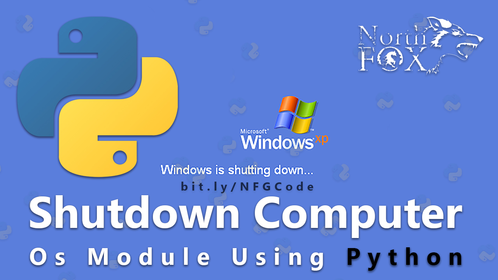

### ShutDown Computer Using Python By NF Py Developers

#### Join Our Telegram Channel [ProgHub09](http://t.me/ProgHub09) and Also Download Our App.




Python File Code :

```
import os

os.system("shutdown /s /t 1")
```